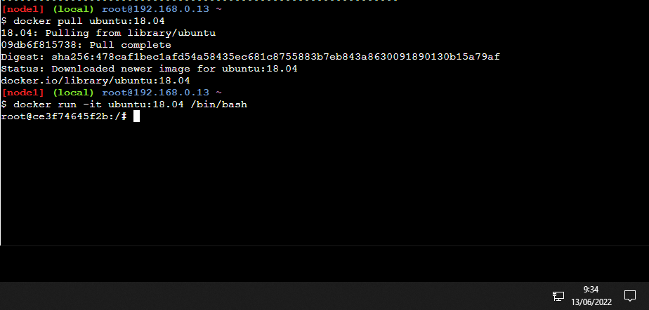
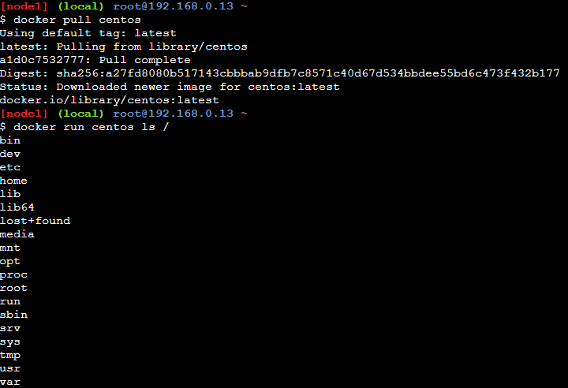
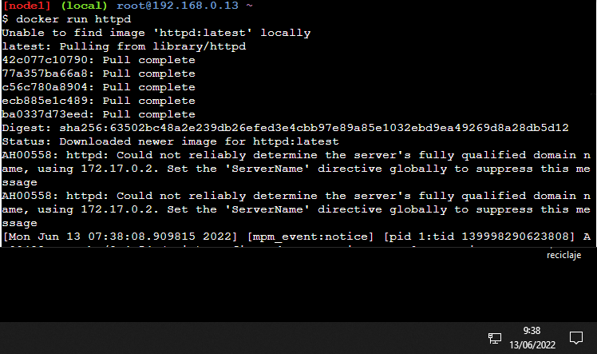
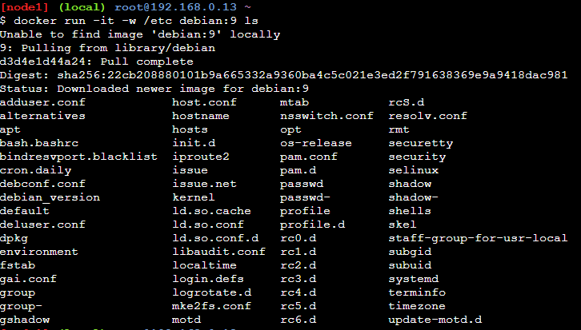
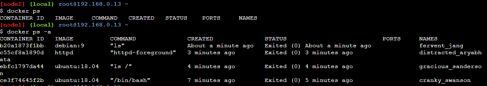

# ExamenDocker

<b>-APARTADO 1-</b>

EJEMPLO 1:

  - Abrimos la consola de comandos de docker.
  - Hacemos un docker pull de ubuntu, esto lo que hara es descargan en nuestro dispositivo la ultima version de dicho contenedor.
  - Una vez descargado el contenedor ejecutamos el comando 'docker run -it ubuntu:18.04 /bin/bash', al ejecutar este comando crearemos el contenedor descargado     anteriormente y a su vez entraremos en el en modo root.
  

EJEMPLO 2:

  - Hacemos el misco proceso que en el anterior pero en vez de ubuntu lo haremos con CentOs.
  - Una vez echo el pull, y nos dispongamos a hacer el run, hay una variacion en respecto al anterior, en vez de acabar con /bin/bash(que nos abre el contenedor como root) ejecutaremos el comando con ls /, esto lo que hace es parar y cerrar el contedor quitandonos el acceso y enseñandos el contenido. 

EJEMPLO 3:

  - Esta vez crearemos el contenedor sin descarga, sin un pull, sino desde un servidor apache.
  - Ejecutando el comando docker run httpd, creamos un contenedor web apache 2.4 y a la vez nos muestra su log(historial de archivos de dicho contenedor).

EJEMPLO 4:

  - Usamos el comando 'docker run -it -w /etc debian:9 ls', este comando lo que va a hacer es creay y ejecutar un contenedor debian 9
  - Gracias al -w se mostrara el contenido de dicho contenedor y se establecera como entorno de trabajo.
  - Con el /etc le indicamos que se creara en la carpeta /etc.
  - El ls sirve para parar y cerrar el contedor.

  - Ejecutaremos los comando 'docker ps' para conocer los contenedor en ejecucion.
  - Usaremos 'docker ps -a ' para conocer los contenedores parados y en ejecucion. 

<b>-APARTADO 1-</b>

